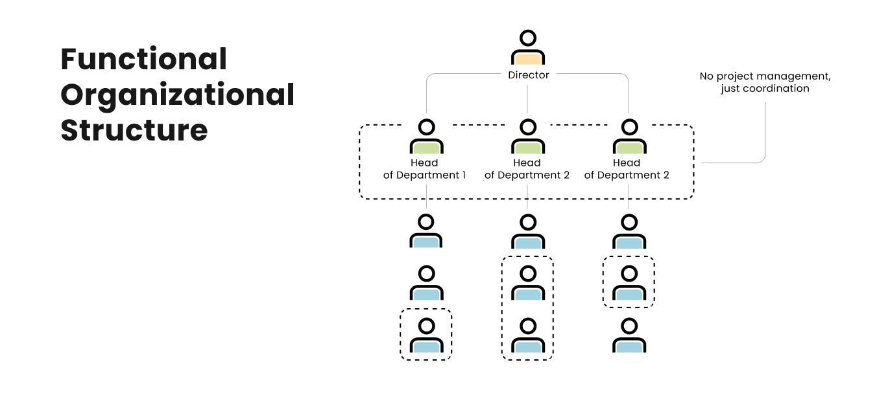
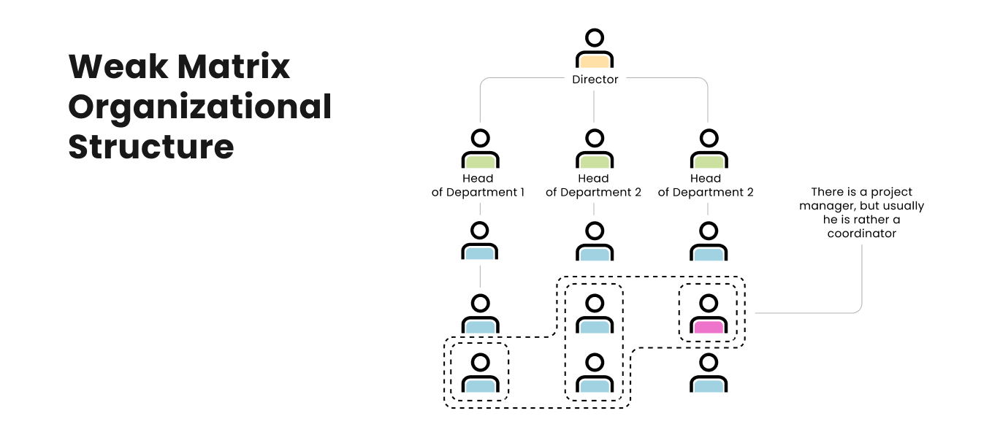
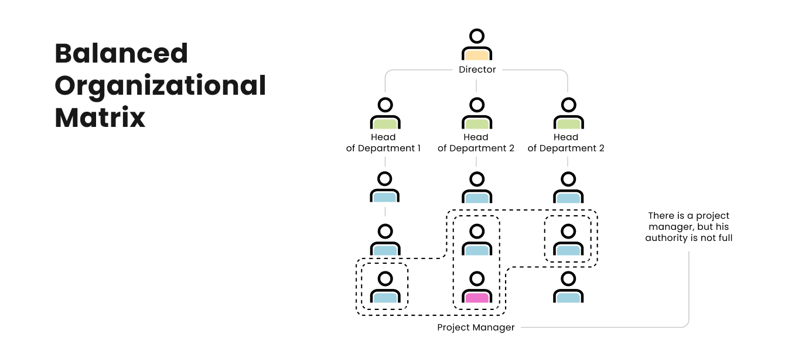
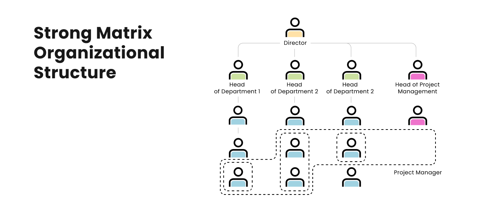
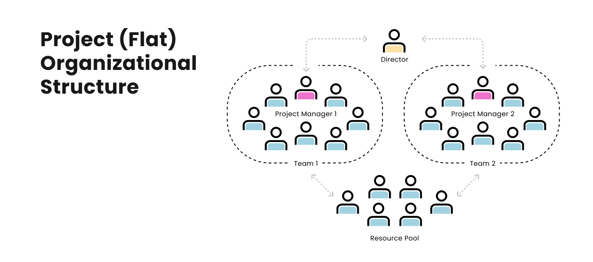

```{=html}
<div class="chapter-banner">
  <div class="chapter-num">Chapter 1 · Foundations</div>
  <h1>Introduction to Project Management</h1>
  <p class="chapter-desc">Understanding what projects are, why they matter, and how engineers can master them.</p>
</div>
```

## Learning Outcomes {.unnumbered}

::: {.callout-tip icon="false"}
## 🎯 Learning Outcomes

By the end of this chapter, you will be able to:

1. **Define** a project and distinguish it from routine operations
2. **Describe** the project lifecycle and its five process groups
3. **Explain** the Triple Constraint and its trade-offs
4. **Identify** the ten PMBOK knowledge areas
5. **Analyse** the reasons why engineering projects succeed or fail
6. **Apply** basic PM concepts to a simple engineering scenario
:::

---

## What Is a Project?

A **project** is a temporary endeavour undertaken to create a unique product, service, or result [@pmbok2021].

::: {.callout-note icon="false"}
## 📖 PMI Definition of a Project

> *"A project is a temporary endeavour undertaken to create a unique product, service, or result. The temporary nature of projects indicates a beginning and an end to the project work."*
> — PMBOK® Guide, 7th Edition
:::

The three essential characteristics of every project are:

```{mermaid}
%%| fig-cap: "The three defining characteristics of any project"
flowchart TD
    P([🗂️ PROJECT]) --> T
    P --> U
    P --> G
    T["⏱️ TEMPORARY<br/>Has a definite start<br/>and end date"]
    U["🔷 UNIQUE<br/>Produces a unique<br/>output or result"]
    G["🎯 GOAL-ORIENTED<br/>Created to achieve a<br/>specific objective"]

    style P fill:#1d4ed8,color:#fff,stroke:#1d4ed8
    style T fill:#dbeafe,stroke:#3b82f6,color:#1e40af
    style U fill:#dcfce7,stroke:#22c55e,color:#166534
    style G fill:#fef9c3,stroke:#eab308,color:#854d0e
```

### Projects vs. Operations

One of the most important distinctions in management is between **projects** and **operations**:

| Characteristic | Projects | Operations |
|----------------|----------|------------|
| **Duration** | Temporary | Ongoing |
| **Output** | Unique | Repetitive |
| **Purpose** | Change | Maintain |
| **Team** | Temporary team | Permanent staff |
| **Budget** | Approved per project | Annual budgets |
| **Risk** | Higher | Lower, routine |

: Comparing projects and operations {.striped .hover}

**Engineering Examples:**

- 🏗️ *Project:* Designing and building a new suspension bridge
- ⚙️ *Operation:* Maintaining and inspecting the bridge annually

- 💻 *Project:* Developing a new traffic management software system
- 🖥️ *Operation:* Running and supporting the traffic management system

---

## The Project Lifecycle

Every project passes through a series of **phases** from inception to completion. The PMI recognises five **Process Groups**:

```{mermaid}
%%| fig-cap: "The five PMI process groups across the project lifecycle"
%%{init: {'flowchart': {'nodeSpacing': 30, 'rankSpacing': 60}}}%%
flowchart LR
    A["🚀 INITIATING<br/>Define project<br/>Authorise & fund<br/>Identify stakeholders"]
    B["📋 PLANNING<br/>Develop the plan<br/>Define scope<br/>Schedule & budget"]
    C["⚙️ EXECUTING<br/>Do the work<br/>Manage teams<br/>Produce deliverables"]
    D["📊 MONITORING<br/>& CONTROLLING<br/>Track progress<br/>Control changes<br/>Manage issues"]
    E["🏁 CLOSING<br/>Finalise all work<br/>Hand over asset<br/>Lessons learned"]

    A --> B --> C --> E
    C --> D
    D --> C
    D --> E
    B --> D

    style A fill:#4f46e5,color:#fff,stroke:#4f46e5
    style B fill:#0f766e,color:#fff,stroke:#0f766e
    style C fill:#15803d,color:#fff,stroke:#15803d
    style D fill:#b45309,color:#fff,stroke:#b45309
    style E fill:#b91c1c,color:#fff,stroke:#b91c1c
```

::: {.callout-note icon="false"}
## 📖 Key Concept — Process Groups vs. Project Phases

**Process Groups** (Initiating, Planning, Executing, Monitoring & Controlling, Closing) describe *what* activities are performed.

**Project Phases** (e.g., Feasibility, Design, Construction, Commissioning) describe *how* the work is organised in a specific industry or project. Multiple process groups may occur within each phase.
:::

### Level of Activity Through the Lifecycle

The level of effort, cost, and staffing varies considerably across the project lifecycle:

```{mermaid}
%%| fig-cap: "Typical level of activity through the project lifecycle"
xychart-beta
    title "Project Activity Level over Time"
    x-axis ["Initiating", "Planning", "Early Execution", "Peak Execution", "Late Execution", "Closing"]
    y-axis "Activity Level (%)" 0 --> 100
    bar [10, 30, 55, 100, 70, 20]
    line [10, 30, 55, 100, 70, 20]
```

---

## The Triple Constraint

The **Triple Constraint** (also known as the *Iron Triangle*) is the foundation of project management. Every project must be managed within three interrelated constraints:

```{mermaid}
%%| fig-cap: "The Triple Constraint (Iron Triangle) of project management"
%%{init: {'flowchart': {'nodeSpacing': 30, 'rankSpacing': 40}}}%%
graph LR
    S["📐 SCOPE<br/>Deliverables & features<br/>What is included?"]
    T["⏱️ TIME<br/>Deadline & schedule<br/>How long will it take?"]
    C["💰 COST<br/>Budget & resources<br/>How much will it cost?"]
    Q["⭐ QUALITY<br/>at the centre"]

    S --- T
    T --- C
    C --- S
    S --- Q
    T --- Q
    C --- Q

    style S fill:#3b82f6,color:#fff,stroke:#3b82f6
    style T fill:#22c55e,color:#fff,stroke:#22c55e
    style C fill:#f97316,color:#fff,stroke:#f97316
    style Q fill:#fef9c3,stroke:#eab308,color:#854d0e
```

::: {.callout-warning icon="false"}
## ⚠️ The Triple Constraint Trade-off

**The golden rule: You cannot change one constraint without affecting at least one other.**

| If the client wants... | Then you must... |
|------------------------|-----------------|
| Reduced cost | Reduce scope OR extend time |
| Shorter time | Increase cost OR reduce scope |
| Increased scope | Increase cost OR extend time |
| All three improved | Accept lower quality |

**As a PM, your job is to manage these trade-offs transparently with your stakeholders.**
:::

### Extended Constraints (The Six-Sided Diamond)

Modern project management recognises additional constraints beyond the original three:

::: {.panel-tabset}

## Scope
**"What are we building?"**
- Defines the work to be completed
- Includes all deliverables and acceptance criteria
- Controlled through a scope management plan
- Changes managed via a formal change control process

## Time
**"When will it be done?"**
- Total project duration and milestone dates
- Drives the schedule and critical path
- Measured via Gantt charts and network diagrams
- Buffer time (float) must be carefully managed

## Cost
**"How much will it cost?"**
- Total approved budget for the project
- Includes labour, materials, equipment, and overheads
- Tracked using Earned Value Management (EVM)
- Contingency reserves held for risks

## Quality
**"How good must it be?"**
- The standard to which deliverables must conform
- Defined in specifications and acceptance criteria
- Managed through QA (prevention) and QC (inspection)
- Cannot be sacrificed to save cost or time

## Risk
**"What could go wrong?"**
- Uncertainty that can affect objectives
- Can be positive (opportunities) or negative (threats)
- Managed through identification, analysis, and response planning
- Risks increase when other constraints are squeezed

## Resources
**"Who and what do we need?"**
- Human resources (skills, availability, roles)
- Physical resources (equipment, materials, facilities)
- Resource constraints often drive schedule changes
- Team management is a key PM competency

:::

---

## The PMBOK Knowledge Areas

The PMI defines **ten Knowledge Areas** that encompass all aspects of project management:

| # | Knowledge Area | Key Processes |
|---|----------------|---------------|
| 1 | 📋 **Integration** | Develop Charter · PM Plan · Direct & Manage Work · Monitor & Control · Integrated Change Control · Close Project |
| 2 | 📐 **Scope** | Collect Requirements · Define Scope · Create WBS · Validate Scope · Control Scope |
| 3 | ⏱️ **Schedule** | Define Activities · Sequence Activities · Estimate Durations · Develop Schedule · Control Schedule |
| 4 | 💰 **Cost** | Plan Cost Mgmt · Estimate Costs · Determine Budget · Control Costs |
| 5 | ✅ **Quality** | Plan Quality · Manage Quality · Control Quality |
| 6 | 👥 **Resources** | Plan Resource Mgmt · Acquire Resources · Develop Team · Manage Team · Control Resources |
| 7 | 📢 **Communications** | Plan Communications · Manage Communications · Monitor Communications |
| 8 | ⚠️ **Risk** | Plan Risk Mgmt · Identify Risks · Perform Risk Analysis · Plan Risk Responses · Implement Responses · Monitor Risks |
| 9 | 🛒 **Procurement** | Plan Procurement · Conduct Procurements · Control Procurements |
| 10 | 🤝 **Stakeholders** | Identify Stakeholders · Plan Engagement · Manage Engagement · Monitor Engagement |

: The ten PMBOK Knowledge Areas {.striped .hover}

---

## Why Projects Fail

Research consistently shows that a large proportion of engineering projects experience cost overruns, schedule delays, or scope issues.

::: {.callout-important icon="false"}
## 🏭 Real-World Data — Project Failure Rates

According to the **Standish Group CHAOS Report 2020** [@standish2020]:

- Only **31%** of IT projects are delivered on time, on budget, and within scope
- **52%** are challenged (late, over budget, or missing features)
- **17%** are outright failures (cancelled or abandoned)

For **large-scale infrastructure projects**, Flyvbjerg's research [@flyvbjerg2009] found:

- **9 out of 10** projects have cost overruns
- Average cost overrun: **28%** for roads, **45%** for rail
- Average schedule overrun: **17–45%** depending on project type
:::

### Root Causes of Project Failure

```{mermaid}
%%| fig-cap: "Common causes of engineering project failure"
%%{init: {'flowchart': {'nodeSpacing': 25, 'rankSpacing': 70}}}%%
flowchart TD
    F(["❌ PROJECT FAILURE"])

    F --> R1["📋 Poor Planning<br/>Unrealistic schedules<br/>Incomplete scope"]
    F --> R2["💬 Communication Breakdown<br/>Unclear requirements<br/>Stakeholder misalignment"]
    F --> R3["🔄 Scope Creep<br/>Undocumented changes<br/>No change control"]
    F --> R4["👥 Resource Issues<br/>Skill shortages<br/>Key person dependency"]
    F --> R5["⚠️ Risk Blindness<br/>Risks not identified<br/>No contingency plans"]
    F --> R6["🏛️ Governance Failure<br/>Weak sponsorship<br/>Conflicting priorities"]

    style F fill:#b91c1c,color:#fff,stroke:#b91c1c
    style R1 fill:#fee2e2,stroke:#ef4444,color:#7f1d1d
    style R2 fill:#fef9c3,stroke:#eab308,color:#854d0e
    style R3 fill:#fed7aa,stroke:#f97316,color:#7c2d12
    style R4 fill:#dbeafe,stroke:#3b82f6,color:#1e3a8a
    style R5 fill:#fce7f3,stroke:#ec4899,color:#831843
    style R6 fill:#dcfce7,stroke:#22c55e,color:#14532d
```

### The Classic PM Triangle — Failure Modes

::: {.callout-warning icon="false"}
## ⚠️ Common Mistake — The "Heroic Engineer" Fallacy

Many engineering projects fail because technical experts underestimate the **management** component. A brilliant technical solution delivered late, over budget, or with poor stakeholder management is **still a failed project**.

Studies show that technical problems account for fewer than **20%** of project failures. The other **80%** are management problems: poor communication, unclear requirements, inadequate planning, or weak leadership.
:::

---

## The Role of the Project Manager

A project manager is more than a technical expert — they are an **integrator, communicator, and leader**.

```{mermaid}
%%| fig-cap: "Key competency areas for a Project Manager"
quadrantChart
    title Project Manager Competency Areas
    x-axis "Technical" --> "Leadership"
    y-axis "Tactical" --> "Strategic"
    quadrant-1 "Strategic Leadership"
    quadrant-2 "Strategic Technical"
    quadrant-3 "Tactical Technical"
    quadrant-4 "Tactical Leadership"
    Scheduling: [0.25, 0.25]
    Risk Analysis: [0.3, 0.45]
    Budgeting: [0.35, 0.3]
    WBS Development: [0.2, 0.35]
    Team Motivation: [0.75, 0.35]
    Conflict Resolution: [0.8, 0.4]
    Stakeholder Mgmt: [0.7, 0.65]
    Vision Setting: [0.65, 0.8]
    Change Leadership: [0.75, 0.75]
    Quality Control: [0.4, 0.4]
```

### PM Skills Framework

::: {.panel-tabset}

## Technical Skills
- **Schedule development** — CPM, Gantt, PERT
- **Cost estimation and budgeting** — EVM, parametric estimating
- **Risk analysis** — FMEA, Monte Carlo simulation
- **Quality management** — Statistical process control
- **Procurement** — Tendering, contract management
- **Tools** — MS Project, Primavera P6, JIRA

## Leadership Skills
- **Team building** and motivation
- **Conflict management** and negotiation
- **Decision making** under uncertainty
- **Communication** (written and verbal)
- **Change management** and adaptability
- **Emotional intelligence** (EQ)

## Business Skills
- **Financial literacy** — ROI, NPV, IRR
- **Strategic thinking** — Business case analysis
- **Stakeholder management** — Influence mapping
- **Contract and legal** basics
- **Organisational awareness** — Navigating power structures

:::

---

## Organisational Structures for Projects

The way an organisation is structured determines **who holds authority over the project manager and team**. The structure shapes communication paths, resource availability, and ultimately, the project manager's power to deliver. PMBOK recognises five main types:

---

### 1. Functional Structure

{fig-align="center" width="80%"}

In a **functional structure**, the organisation is divided into specialised departments (Engineering, Finance, Manufacturing, etc.), each led by a director. It is the classic hierarchy seen in government, military, and traditional manufacturing.

::: {.callout-warning icon="false"}
## ⚖️ PM Authority: **Very Low — Acts as Coordinator Only**

The PM cannot directly assign tasks to other departments. Every request must pass **up** to the department head, who then delegates it **down**. Results travel back up the same chain. The PM holds accountability without matching authority.
:::

| | Functional |
|---|---|
| **PM Authority** | Little or none |
| **Resource Control** | Functional managers own resources |
| **PM Role** | Part-time coordinator |
| **Budget Control** | Functional manager |
| **Best For** | Stable, repetitive work; single-department projects |

**✅ Advantages**
- Clear career paths and deep technical specialisation
- Efficient use of shared resources across multiple projects
- Strong departmental expertise and quality control

**❌ Disadvantages**
- Extremely poor horizontal communication
- PM lacks authority to drive cross-department coordination
- Slow decision-making — everything travels up and down the chain
- Team loyalty is to the department, not the project

---

### 2. Weak Matrix Structure

{fig-align="center" width="80%"}

The **weak matrix** resembles the functional structure on an org chart, but horizontal communication is slightly improved. Employees from other departments will at least listen, though the PM still cannot assign tasks or change plans without department head approval. The PM often emerges from among the performers (e.g., a developer on an IT project).

::: {.callout-warning icon="false"}
## ⚖️ PM Authority: **Low — Plans Require Department Head Approval**

Employees have **dual reporting lines** — to both their department head and the PM — but the department head's word takes precedence. Part-time involvement is common.
:::

| | Weak Matrix |
|---|---|
| **PM Authority** | Low |
| **Resource Control** | Mostly functional managers |
| **PM Role** | Part-time |
| **Budget Control** | Functional manager |
| **Best For** | Manufacturing environments adding new capacity with minimal PM change |

**✅ Advantages**
- Slightly better cross-department collaboration than pure functional
- Low disruption to existing structure
- Flexible — employees remain in home departments

**❌ Disadvantages**
- PM still lacks real authority to drive the project
- Dual reporting creates confusion and conflict
- Difficult to get employee time committed to project work

---

### 3. Balanced Matrix Structure

{fig-align="center" width="80%"}

The **balanced matrix** is common in IT companies and engineering firms. A real project manager exists with genuine responsibility and authority. Employees clearly understand they have two supervisors — their department head and the PM — and they respect both equally.

::: {.callout-tip icon="false"}
## ⚖️ PM Authority: **Medium — Shared Equally with Functional Managers**

The PM can influence task priorities and may have input into hiring/firing decisions. Decisions are made collaboratively between the PM and department heads. The department head focuses on employee development; the PM focuses on deadlines and deliverables.
:::

| | Balanced Matrix |
|---|---|
| **PM Authority** | Medium |
| **Resource Control** | Shared |
| **PM Role** | Full-time |
| **Budget Control** | Mixed (PM and functional manager) |
| **Best For** | IT projects, product development, engineering firms |

**✅ Advantages**
- Efficient resource sharing across multiple projects
- Strong communication between functional expertise and project needs
- PM has real influence over project outcomes
- Employees maintain professional development through home department

**❌ Disadvantages**
- Dual authority can create conflict over priorities
- Requires skilled negotiation between PM and department heads
- More complex to manage than pure functional or projectised

---

### 4. Strong Matrix Structure

{fig-align="center" width="80%"}

In a **strong matrix**, the PM's authority is dominant. A dedicated Project Management Office (PMO) exists as its own department. The PM handles hiring, firing, task assignment, and priority setting decisively. This person is a full-time project management professional with no other technical role.

::: {.callout-tip icon="false"}
## ⚖️ PM Authority: **High — PM Leads; Functional Managers Support**

The PM can unilaterally adjust plans, assign resources, and make staffing decisions. The PMO is a recognised power centre within the organisation.
:::

| | Strong Matrix |
|---|---|
| **PM Authority** | High |
| **Resource Control** | Primarily PM |
| **PM Role** | Full-time |
| **Budget Control** | Project manager |
| **Best For** | Large complex projects, companies running many concurrent projects |

**✅ Advantages**
- Clear PM authority enables fast decision-making
- Enhanced cross-functional communication
- Projects aligned with strategic objectives
- Best balance of specialisation and project focus

**❌ Disadvantages**
- Functional managers may feel their authority is undermined
- Risk of conflict between PMO and functional departments
- Requires mature PM professionals

---

### 5. Projectised (Flat) Structure

{fig-align="center" width="80%"}

In a **projectised** (or flat) structure, there are no permanent departments — only a resource pool and project managers. When a project is launched, the PM selects team members from the pool, builds the team, and leads them to completion. Unused staff remain in the pool awaiting the next project. This is common in large outsourcing and consultancy firms.

::: {.callout-important icon="false"}
## ⚖️ PM Authority: **Full — Absolute Authority Over the Project**

The PM does not consult with anyone else. They are fully responsible for hiring, firing, scheduling, and budget. There is no functional manager counterpart.
:::

| | Projectised |
|---|---|
| **PM Authority** | Full / Absolute |
| **Resource Control** | Project manager |
| **PM Role** | Full-time |
| **Budget Control** | Project manager |
| **Best For** | Large outsourcing firms, defence contractors, construction megaprojects |

**✅ Advantages**
- Maximum PM authority — fastest decision-making
- Team fully dedicated to the project (no split loyalties)
- Clearest accountability

**❌ Disadvantages**
- No home base for employees — loss of career development and mentoring
- Resources may sit idle between projects (costly)
- Duplication of specialist roles across projects
- When the project ends, the team disperses

---

### Authority Comparison Summary

| Characteristic | Functional | Weak Matrix | Balanced Matrix | Strong Matrix | Projectised |
|---|---|---|---|---|---|
| **PM Authority** | None | Low | Medium | High | Full |
| **Resource Availability** | Low | Low | Medium | High | Full |
| **Budget Control** | Functional Mgr | Functional Mgr | Mixed | PM | PM |
| **PM Role** | Part-time | Part-time | Full-time | Full-time | Full-time |
| **Team Loyalty** | Department | Department | Shared | Project | Project |
| **Decision Speed** | Slow | Slow | Moderate | Fast | Fastest |

: Comparison of organisational structures by PM authority {.striped .hover}

::: {.callout-note icon="false"}
## 📖 Key Insight

Most engineering organisations use a **matrix structure** of some kind. Understanding which type your organisation uses is critical — it tells you exactly how much authority you actually have as a project manager, and what strategies you need to get things done.
:::

---

## Case Study — Rawabi New City, Palestine {.unnumbered}

::: {.callout-important icon="false"}
## 🏭 Case Study: Rawabi — Palestine's First Planned City

**Background:**  
Rawabi (رواب، "hills" in Arabic) is the first planned Palestinian city, built on the hills north of Ramallah in the West Bank. Developed by Bayti Real Estate Investment Company (founder: Bashar Masri) with approximately **$1 billion** investment from Qatari Diar, Rawabi represents one of the most challenging and inspiring project management achievements in the Arab world — a city built against extraordinary political, logistical, and financial obstacles.

**Original Plans (2009):**
- Budget: Approximately **$1 billion** (Phase 1)
- Duration: **3 years** — first residents targeted for 2012
- Scope: 6,000 housing units, 40,000 residents, commercial district, schools, amphitheatre

**Actual Outcome:**
- First residents moved in: **February 2016** *(4 years late)*
- Continued expansion through 2020s despite ongoing constraints
- Phase 1 delivered; city operational and growing

**Key Challenges Unique to this Project:**

| Factor | What Happened |
|--------|--------------|
| Access Road Blocked | The only viable construction access road required Israeli Civil Administration approval — denied for 2+ years, halting heavy equipment deliveries entirely |
| Import Permit Restrictions | Cement, steel, and crushed stone required import permits via Israeli-controlled crossings; strategic 6-month stockpiles were maintained |
| Financing Uncertainty | Qatari Diar payments were tied to political developments; phased construction aligned with available cash |
| Unproven Market | First market-rate housing project in Palestine — no historical price data; pre-sales of 3,000+ units carried out before construction started |
| Skilled Labour Scarcity | Specialist MEP trades unavailable locally; training programmes for Palestinian youth were launched on site |

**Lessons Learned:**
1. **Political and external constraints are real risks** — a 2-year access road delay was foreseeable and must appear in the risk register with a mitigation plan
2. Stakeholder management beyond the project boundary (foreign governments, approval authorities) is sometimes more important than managing construction
3. Cash-flow planning under politically uncertain financing requires 12+ months of reserve capacity
4. Phased delivery maintains credibility — delivering housing blocks sequentially built buyer trust during delays
5. Scope discipline under adversity: when deadlines slipped, the temptation to add unplanned features was resisted

**What Worked:**
Despite facing constraints that would have ended most projects, Rawabi delivered a functional city of 6,000 homes, a thriving commercial street, schools, a 15,000-seat amphitheatre, and a technology park — demonstrating that strong leadership, community stakeholder engagement, and financial resilience can overcome extraordinary external constraints.

**Discussion Questions:**
1. Which of the PMBOK knowledge areas was most severely impacted by the political constraints on this project?
2. How would you conduct a stakeholder analysis when a non-traditional "stakeholder" (a foreign government with approval authority) is in scope?
3. If you were preparing the business case for Rawabi in 2008, what risk contingency would you have recommended for the access road issue?

*Sources: @masri2010rawabi; @flyvbjerg2009*
:::

---

## 1.9 Exercises {.unnumbered}

::: {.callout-caution icon="false"}
## ✏️ Exercise 1.1 — Project vs. Operation Classification

Classify each of the following as either a **Project** or an **Operation**. For each project, identify the three constraints (scope, time, cost):

1. Building a new highway interchange
2. Weekly maintenance of a water treatment plant  
3. Developing a new structural analysis software tool
4. Operating a production line to manufacture steel beams
5. Designing and installing a solar power system for a hospital
6. Conducting annual safety inspections of an offshore platform
7. Relocating a factory to a new site
8. Running daily quality checks on concrete samples

**Reflection:** What criteria did you use to distinguish projects from operations?
:::

::: {.callout-caution icon="false"}
## ✏️ Exercise 1.2 — Triple Constraint Analysis

An engineering consulting firm is contracted to design a bridge. The original contract states:

- **Scope:** Full structural design, drawings, and specifications
- **Time:** 8 months
- **Cost:** $450,000 fixed price

After 3 months, the client requests:
- Inclusion of seismic analysis (not in original scope)
- Deadline brought forward by 6 weeks (client's new funding deadline)
- No increase in fee

Using the Triple Constraint model:

1. Analyse the impact of each change request
2. What trade-offs would you propose to the client?
3. Draft a brief response (2-3 sentences) for each change request
4. Which request would you consider most unreasonable, and why?
:::

::: {.callout-caution icon="false"}
## ✏️ Exercise 1.3 — PM Knowledge Areas Mapping

For the following engineering project — *"Construction of a 50 MW Solar Farm"* — identify at least TWO specific activities or deliverables for FIVE of the ten PMBOK knowledge areas.

Present your answer in a table with columns: Knowledge Area | Activity 1 | Activity 2

**Bonus:** Identify which two knowledge areas you think will be MOST challenging for this project and explain why.
:::

::: {.callout-caution icon="false"}
## ✏️ Exercise 1.4 — Root Cause Analysis

Read the following scenario and identify the root causes of the project failure:

> "A major city council contracted an engineering firm to install a new smart traffic control system across 200 intersections. The project had an 18-month deadline and a $12M budget. After 24 months and $18M spent, the system was still not operational. The software contractor delivered code 6 months late, which meant hardware installation had to start before software testing was complete. The council kept adding intersections to the scope. Three project managers resigned during the project. The final handover revealed that 40 intersections were wired incorrectly."

1. List all the root causes you can identify (minimum 5)
2. For each root cause, state which PMBOK knowledge area was at fault
3. Propose one preventive action for each root cause
:::

---

## Summary {.unnumbered}

```{mermaid}
%%| fig-cap: "Chapter 1 key concepts summary"
mindmap
  root((Chapter 1<br/>Key Concepts))
    Project Definition
      Temporary
      Unique
      Goal-oriented
    Project Lifecycle
      Initiating
      Planning
      Executing
      Monitoring & Controlling
      Closing
    Triple Constraint
      Scope
      Time
      Cost
      Quality at centre
    PMBOK Knowledge Areas
      10 areas
      Integration is central
    Why Projects Fail
      Poor planning
      Scope creep
      Communication breakdown
      Risk blindness
    PM Role
      Technical skills
      Leadership skills
      Business skills
```

::: {.callout-note}
## 📚 Further Reading

- @pmbok2021 — Chapter 1: Introduction
- @kerzner2017 — Chapter 1: Overview of Project Management
- @larson2021 — Chapter 1: Modern Project Management
- @flyvbjerg2009 — Research on infrastructure project overruns
:::

**Next Chapter →** [Project Initiation](02-initiation.qmd) — Learn how to formally start a project, develop a project charter, and identify your key stakeholders.
